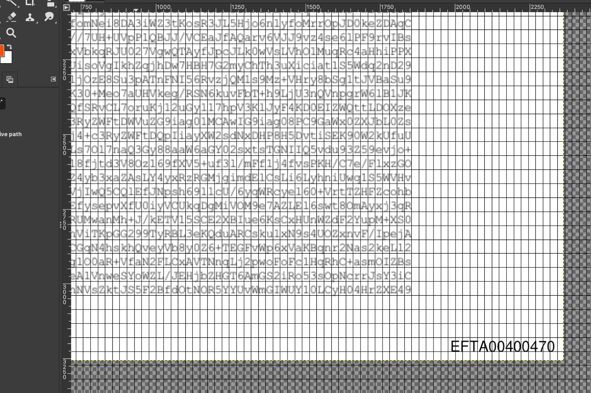
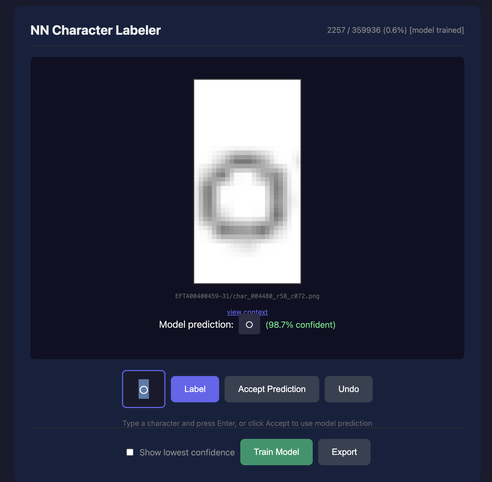

# Courier New OCR Trainer

attempted ocr to pdf parser

this is in response to https://neosmart.net/blog/recreating-epstein-pdfs-from-raw-encoded-attachments/

## Installation
python, please use a venv, `requirements.txt`

Download the set of images from https://archive.org/download/efta-00400459-lossless-webp, and extract the zip

Use `extract.py` to extract individual glyphs from the images.
Figure out the offsets for the grid. I used these values, but you might try tweaking them.
```bash
mkdir out
for f in images/*; do python extract.py $f out/`basename $f .webp` --char-width 24.4 --char-height 46.85 --grid-x 188 --grid-y 115.7 --cols 76 --rows 64; done
```
You can use GIMP's grid feature to overlay a grid and figure out the parameters:


This will make a bunch of subdirectories in `out/`. It used about 1.5G on my machine.

Remove the directories for the first and last page as they have a bunch of extra stuff that isn't base64 text.

## Running it

```bash
cd web; python nn_labeler.py
firefox http://localhost:5000
```



Once you've labeled about 200 glyphs, you can run Train Model to get an initial training set.
You can choose whether you want to do random glyphs (default) or focus specifically on the low-confidence ones.

Labels are preserved (in `nn_labels.json`) so you can refresh, etc.
Once you're confident, you can Export Model to get the labels.

mostly vibecoded, see `transcripts/`
